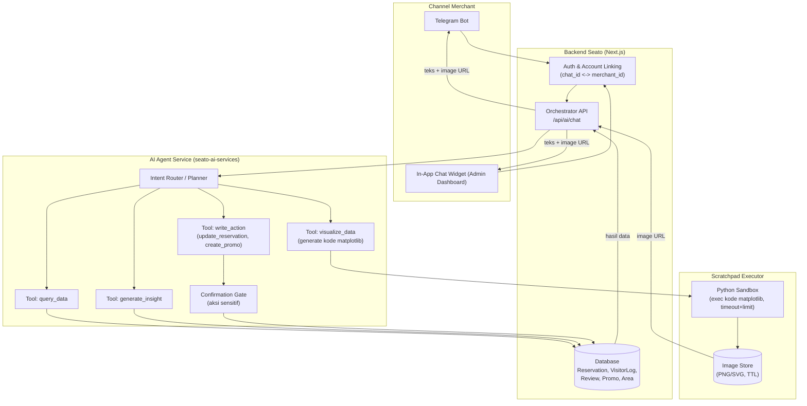
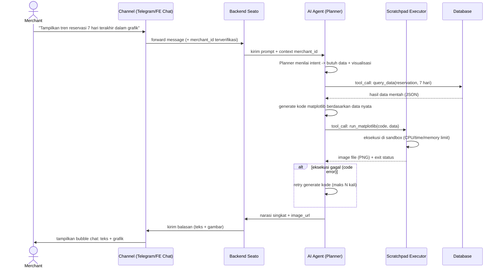

# AI Agentic Chatbot — Arsitektur & Flow

> Catatan format: diagram memakai Mermaid (render native di GitHub), bukan `.drawio`
> seperti di `uml_technical/`, karena layout `.drawio` tidak bisa saya buat secara
> presisi tanpa editor visual. Kalau Anda butuh versi `.drawio`, diagram Mermaid ini
> bisa jadi acuan untuk digambar ulang di draw.io.

## 1. Komponen Utama

- **Channel**: Telegram Bot / in-app chat widget (frontend Seato Admin)
- **Backend Seato (Next.js)**: autentikasi, data owner (Prisma/DB), orchestrator permintaan
- **AI Agent Service (seato-ai-services)**: reasoning + tool-use (function calling)
- **Scratchpad Executor**: sandbox Python terpisah yang menjalankan kode matplotlib
  yang di-generate AI, lalu mengubahnya jadi file gambar (PNG/SVG)
- **Object storage sementara**: tempat menyimpan hasil gambar scratchpad agar bisa
  diakses via URL oleh frontend/Telegram

## 2. Arsitektur Tingkat Tinggi

## 3. Sequence Diagram — Contoh "Tampilkan grafik tren reservasi"

Ini skenario di mana AI memutuskan sendiri bahwa jawaban terbaik adalah berupa
visualisasi, lalu men-generate kode matplotlib (scratchpad), menjalankannya, dan
mengirim hasilnya balik ke chat.

## 4. Alasan Desain Scratchpad (kritis, bukan sekadar "AI bikin gambar")

- **Kenapa matplotlib dieksekusi di sandbox terpisah, bukan di proses utama AI
  service?** Kode yang di-generate LLM tidak boleh dipercaya begitu saja —
  harus dijalankan dengan batas waktu, batas memori, dan tanpa akses
  filesystem/network, supaya kode error atau kode berbahaya (meski kecil
  kemungkinan) tidak bisa mengganggu service utama.
- **Kenapa AI tidak boleh "mengarang" data untuk chart?** Kode matplotlib harus
  dibangun dari hasil `query_data` yang nyata (bukan AI menebak angka), konsisten
  dengan guardrail anti-fabrikasi yang sudah ada di skill SWOT/STP.
- **Kenapa ada retry loop?** Kode yang di-generate LLM kadang syntax error atau
  salah assign variabel — perlu mekanisme "coba lagi dengan error message
  sebagai feedback" sebelum menyerah dan menjawab tanpa visual.
- **Aksi sensitif (`write_action`) tetap lewat Confirmation Gate** — konsisten
  dengan pembahasan sebelumnya: AI boleh otonom untuk baca data & visualisasi,
  tapi tidak untuk aksi yang berdampak finansial/operasional tanpa approve
  merchant.

## 5. Risiko yang Perlu Diputuskan Lebih Dulu

1. **Biaya kompute sandbox** — setiap permintaan visualisasi berarti spin-up
   proses Python terisolasi; perlu ada rate limit per merchant per hari.
2. **Keamanan sandbox** — wajib pakai container terisolasi (misal gVisor/
   nsjail/Docker tanpa network) kalau dirilis ke publik, bukan `exec()` polos.
3. **Latency** — generate kode + eksekusi + render gambar menambah waktu respons
   dibanding jawaban teks biasa; perlu loading state yang jelas di chat UI.
