# AI Weekly Report — Activity Diagram

Fitur: laporan mingguan otomatis untuk merchant yang berisi (1) prediksi cuaca
minggu depan, (2) interpretasi performa bisnis minggu ini berdasarkan data Seato,
dan (3) rekomendasi tindakan — dikirim ke merchant dan juga tampil di dashboard.

## 1. Activity Diagram (swimlane: Scheduler / External API / AI Service / Database / Merchant)

```mermaid
flowchart TD
    START(["Cron Trigger\nSetiap Senin 06:00"]) --> A1

    subgraph SCHED["Scheduler / Backend Seato"]
        A1["Ambil daftar merchant aktif"]
        A2["Kumpulkan data minggu lalu per merchant:\nviews, profile visits, reservation,\noccupancy, revenue, review"]
        A3["Ambil lokasi merchant\n(lat/long dari profil)"]
    end

    A1 --> A2 --> A3 --> B1

    subgraph WEATHER["External Weather API"]
        B1["Request prediksi cuaca 7 hari\n(lokasi merchant)"]
        B2{"API berhasil?"}
    end

    B1 --> B2
    B2 -- "Tidak" --> B3["Catat: data cuaca tidak tersedia\n(limitation eksplisit)"]
    B2 -- "Ya" --> B4["Normalisasi data cuaca\n(suhu, curah hujan, kondisi per hari)"]
    B3 --> C1
    B4 --> C1

    subgraph AISVC["AI Agent Service"]
        C1["Interpretation Step:\ngabungkan data bisnis + cuaca minggu ini"]
        C2{"Ada anomali/insight\nsignifikan?"}
        C3["Highlight temuan utama\n(contoh: okupansi weekday turun\nbertepatan hujan)"]
        C4["Ringkasan performa standar\n(tanpa anomali besar)"]
        C5["Strategy & Action Generation:\nrekomendasi minggu depan\n(dikaitkan prediksi cuaca)"]
        C6{"Perlu visualisasi tren?"}
        C7["Scratchpad: generate kode matplotlib\n-> eksekusi sandbox -> image"]
        C8["Susun laporan akhir:\nnarasi + chart + action items"]
    end

    C1 --> C2
    C2 -- "Ya" --> C3 --> C5
    C2 -- "Tidak" --> C4 --> C5
    C5 --> C6
    C6 -- "Ya" --> C7 --> C8
    C6 -- "Tidak" --> C8

    subgraph DBSTEP["Database"]
        D1[("Simpan WeeklyReport\n(narrative, chart_url, actions, periode)")]
    end

    C8 --> D1 --> E1

    subgraph DELIVER["Delivery ke Merchant"]
        E1{"Kirim notifikasi?"}
        E2["Kirim via Email / Telegram / WA"]
        E3["Tampilkan di Dashboard\ntab 'Weekly Report'"]
    end

    E1 -- "Ya" --> E2 --> E3
    E1 -- "Tidak (hanya simpan)" --> E3
    E3 --> END(["Selesai"])
```

## 2. Catatan Kritis per Tahap

- **Kumpulkan data minggu lalu (A2)**: kalau data minggu ini terlalu tipis
  (merchant baru, traffic sangat kecil), laporan harus secara eksplisit
  menyatakan keterbatasan itu — bukan memaksa membuat insight dari data minim.
- **Prediksi cuaca (B1-B4)**: sumber data harus jelas (misal BMKG API untuk
  Indonesia, atau provider cuaca komersial) dan **wajib ada fallback** (B3) kalau
  API down — laporan tidak boleh gagal total hanya karena cuaca tidak tersedia.
- **Korelasi cuaca-bisnis (C1)**: ini bagian paling rawan asumsi palsu — AI
  tidak boleh mengklaim "hujan menyebabkan reservasi turun" kalau datanya tidak
  cukup mendukung korelasi itu secara statistik. Harus dinyatakan sebagai
  observasi/kemungkinan, bukan sebab-akibat pasti, kecuali benar-benar
  signifikan secara data historis.
- **Decision anomali (C2)**: threshold "signifikan" harus didefinisikan secara
  eksplisit (misal: deviasi >15% dari rata-rata 4 minggu terakhir), bukan
  keputusan subjektif AI saat itu juga.
- **Rekomendasi (C5)**: harus actionable dan dikaitkan ke prediksi cuaca kalau
  relevan — contoh: "Hujan diprediksi Kamis sore, siapkan promo delivery/indoor
  seating untuk mengantisipasi penurunan walk-in."

## 3. Ketergantungan Eksternal yang Perlu Diputuskan

| Kebutuhan | Opsi |
|---|---|
| Sumber data cuaca | BMKG (gratis, fokus Indonesia) vs OpenWeatherMap (lebih luas, ada free tier terbatas) |
| Channel pengiriman | Email (sudah ada `EmailService`) / Telegram (bahasan sebelumnya) / WA (butuh Business API) |
| Jadwal | Mingguan (Senin pagi) — perlu dikonfirmasi apakah semua merchant mau jadwal sama atau bisa custom |
