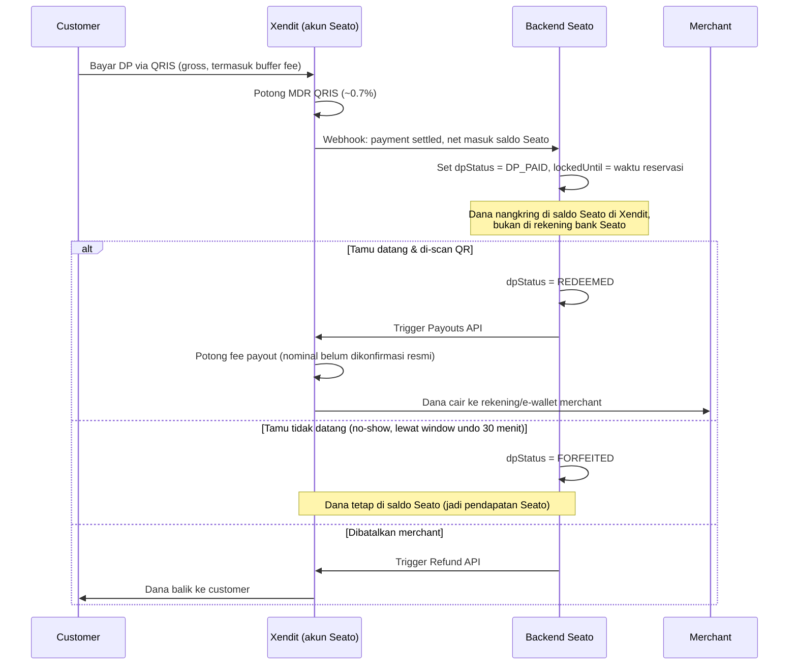

# Riset Midtrans vs Xendit — Hold/Delayed-Split & Refund QRIS untuk DP Reservasi

**Timestamp:** 2026-10-09
**PIC:** Bagus (CTO)
**Status:** Draft diskusi — belum final, beberapa poin masih butuh konfirmasi langsung ke Xendit/Midtrans
**Terkait:** Decision Backlog Fase 1 #1 (`20261008_1835_problem5_tupoksi_role_dan_decision_backlog.md`), Problem4 §4 (`problem_and_solution 4 DP merchant/20261008_0024_problem4_teknis_dp_sisi_merchant.md`)

---

## 1. Pertanyaan yang Dijawab

Decision Backlog Fase 1 #1: *"Riset dukungan hold/delayed-split Midtrans vs Xendit (sumber resmi)"* — item blocking tertinggi, jadi dasar milih opsi penahanan dana DP di Problem4 §4:

- **Opsi A** — Gateway menahan lewat hold/delayed split (selaras klaim "Seato tidak pegang uang")
- **Opsi B** — Dana langsung ke merchant saat DP lunas (butuh clawback + saldo jaminan)
- **Opsi C** — Seato menahan dana di escrow sendiri (kemungkinan butuh izin PJP)

## 2. Temuan dari Sumber Resmi

### 2.1 Fitur Split/Hold

| | Midtrans | Xendit |
|---|---|---|
| Produk split settlement publik | **Tidak ditemukan.** Yang ada cuma Capture API (auth+capture) — khusus kartu kredit, tidak relevan ke QRIS | **Ada** — xenPlatform "Split Rule" (`split_rules` endpoint), bisa flat/persentase, multi-currency IDR/PHP/THB/VND/MYR |
| QRIS termasuk channel yang didukung split? | N/A — produknya sendiri tidak ada | **Tidak terkonfirmasi.** Dokumentasi Split Payments tidak menyebut QRIS/QR Code sebagai channel yang didukung |
| Catatan | — | Split dieksekusi **saat settlement transaksi**, bukan mekanisme tunda/hold. Split rule 100% akan gagal karena fee harus dipotong dari sisa saldo |

Sumber:
- [Xendit — Split Payments](https://docs.xendit.co/docs/split-payments)
- [Xendit — Split Settlement (via Hyperswitch, referensi pihak ketiga)](https://docs.hyperswitch.io/other-features/connectors/split-payments/xendit-split-payments)

**Catatan penting:** Split ≠ hold. Split cuma menentukan pembagian dana **pada saat settlement**, bukan menunda pencairan sampai event di masa depan (misal sampai tamu redeem). Jadi walau QRIS ternyata support split, itu tetap tidak memberi kemampuan "tahan sampai kondisi X terpenuhi" yang dibutuhkan Problem4 §4.

### 2.2 Refund QRIS

| | Midtrans | Xendit |
|---|---|---|
| Endpoint | `POST /v2/{order_id\|transaction_id}/refund` (satu endpoint untuk semua use case) | `POST /qr_codes/payments/:qrpy_id/refunds` |
| Window refund | GoPay ON-US: 45 hari, GoPay OFF-US: 7 hari, ShopeePay/AirPay: 365 hari | 30 hari dari tanggal bayar |
| Batasan issuer | GoPay Static QRIS (sejak Jan 2024) harus pakai `transaction_id`, bukan `order_id` | **GoPay tidak bisa direfund** lewat endpoint ini. Hanya DANA, ShopeePay, OVO, LinkAja, Mandiri, Permata, CIMB, Jenius/BTPN, BSI. Partial refund tidak berlaku di semua issuer (LinkAja, CIMB tidak support partial) |
| Batasan waktu | Refund diblokir 23:55–06:00 WIB (ShopeePay/AirPay) | Tidak disebut |
| Idempotensi | `refund_key` — key sama = retry refund sama, key baru = refund baru | Webhook callback, status awal `PENDING` |
| Jalur manual | Refund manual via dashboard (MAP) tersedia | **Tidak tersedia** di dashboard — harus kontak Customer Success, SLA 14 hari |

Sumber:
- [Midtrans — Refund Transactions](https://docs.midtrans.com/reference/refund-transaction)
- [Midtrans — Direct Refund Transaction](https://docs.midtrans.com/reference/direct-refund-transaction)
- [Midtrans — QRIS Reference](https://docs.midtrans.com/reference/qris)
- [Xendit — Refund QR Payment Flow](https://docs.xendit.co/qr-codes/payment-flows/refund)
- [Xendit Help Center — How to refund a QR Code transaction using API](https://help.xendit.co/hc/en-us/articles/17209624920345-How-to-refund-a-QR-Code-transaction-using-API)

### 2.3 Fitur yang Justru Relevan: Xendit Payouts API ("Escrow Marketplace")

Dari [Xendit — Payouts via API](https://docs.xendit.co/docs/payouts-via-api), salah satu use case resmi yang disebut eksplisit:

> **Escrow marketplace:** pembayaran pelanggan yang sudah terverifikasi diteruskan ke merchant.

Ini pola berbeda dari Split Rule. Alur yang tersirat:
1. Charge QRIS dibuat pakai akun/API key **Seato sendiri** (bukan di-route ke sub-account merchant) → dana otomatis masuk ke **saldo Seato di Xendit**, tanpa perlu fitur split.
2. Dana "nangkring" di saldo itu selama status reservasi (`DP_PAID`) — ini hold versi aplikasi, dikontrol oleh state machine Seato sendiri, bukan oleh gateway.
3. Begitu `REDEEMED`, Seato **trigger Payouts API** untuk kirim dana ke rekening/e-wallet merchant.

Halaman ini **tidak menjelaskan detail mekanisme hold** (cuma menyebut use case-nya), dan **tidak menyebut QRIS maupun split settlement** sama sekali — jadi detail ini perlu divalidasi lagi langsung ke Xendit (sales/account manager) atau lewat sandbox test, bukan diasumsikan dari satu halaman ini saja.

## 3. Rekomendasi

**Jangan bergantung pada fitur split gateway.** Baik Midtrans (tidak punya produknya) maupun Xendit (ada produknya, tapi QRIS belum terkonfirmasi) tidak memberi kepastian untuk Opsi A versi "gateway otomatis split". Lagipula, split secara konsep tidak memberi kemampuan tunda yang dibutuhkan.

**Bangun orkestrasi di backend Seato sendiri, di atas infrastruktur standar Xendit (collect + payout):**
- Collect: QRIS charge biasa, settle ke saldo Seato (tanpa split, tanpa fitur khusus)
- Hold: dikontrol oleh field `dpStatus`/`lockedUntil` yang sudah direncanakan di Problem4 §2.2 — tidak butuh komponen baru
- Release: satu kali panggilan Payouts API saat `REDEEMED`; refund API saat `REFUNDED`

Ini secara substansi lebih dekat ke **Opsi A dengan eksekusi custom**, bukan Opsi C murni — karena dana tetap berada di infrastruktur Xendit (PJP berlisensi), bukan di rekening bank Seato sendiri. Tapi pembeda ini **perlu dikonfirmasi ke tim legal/CFO** karena dari sudut pandang regulasi, "siapa yang dianggap menguasai dana" saat ada di saldo platform milik Seato di Xendit masih perlu divalidasi — tidak otomatis sama dengan Opsi A yang dibayangkan di Problem4 (gateway yang menahan atas nama sistemnya sendiri).

## 4. Diagram Alur



## 5. Perhitungan Fee (Gross-Up) — Keputusan: Customer yang Nanggung

**Keputusan:** kalau DP ditampilkan Rp50.000, merchant harus terima **Rp50.000 utuh**. Selisih fee di-gross-up ke nominal yang dibayar customer, bukan dipotong dari merchant atau ditombok Seato.

Formula: `Nominal_bayar_customer = (Nominal_DP_merchant + fee_payout) / (1 - MDR%)`

Dengan angka resmi yang sudah terkonfirmasi:
- MDR QRIS: **0,7%** (aturan Bank Indonesia, bukan kebijakan gateway — [Midtrans, QRIS fee](https://docs.midtrans.com/docs/what-is-the-applicable-transaction-fee-for-qris))
- Fee payout Xendit: **Rp2.500 flat/transaksi** (di luar PPN), hanya dikenakan kalau disbursement **sukses** — [Xendit Help Center — What is the fee charged for payouts](https://help.xendit.co/hc/en-us/articles/360046511691-What-is-the-fee-charged-for-payouts-), [Xendit Pricing (ID)](https://xendit.co/en-id/pricing/)

```
X = (50.000 + 2.500) / (1 - 0.007)
X = 52.500 / 0.993
X ≈ Rp52.871
```

Jadi customer bayar **~Rp52.871** untuk DP yang ditampilkan Rp50.000 ke merchant. Catatan: Rp2.500 ini belum termasuk PPN — perlu konfirmasi apakah PPN ditambahkan di atasnya atau sudah termasuk.

### 5.1 Refund vs Forfeiture — Dua Fee yang Berbeda

Dua kejadian ini **tidak boleh disamakan**:

| Kejadian | Uang mengalir ke | API yang dipanggil | Fee yang berlaku |
|---|---|---|---|
| **Forfeiture** (no-show / user cancel di app sebelum jadwal) | Saldo Seato → **merchant** | Payouts API | Fee payout Rp2.500 saja. Tidak ada refund, jadi tidak ada aturan "fee refund" yang relevan |
| **Refund** (merchant cancel, bukan salah user) | Saldo Seato → **customer** | Refund API | Tergantung timing — lihat di bawah |

Aturan refund QRIS di Xendit ([Xendit — QR refund flow](https://docs.xendit.co/qr-codes/payment-flows/refund)):
- **Refund full dalam 24 jam** dari pembayaran → MDR yang sudah terpotong **dikembalikan penuh**
- **Refund partial, atau refund lewat 24 jam** → MDR **tidak dikembalikan**, hangus

**Implikasi buat Arif (COGS):** merchant-cancel biasanya terjadi **lebih dari 24 jam** setelah DP dibayar (reservasi dibuat beberapa hari sebelum tanggal makan, merchant baru cancel mendekati hari-H). Artinya **sebagian besar kasus refund kemungkinan besar TIDAK dapat MDR balik** — MDR 0,7% itu jadi biaya yang hilang per refund, perlu dimasukkan ke model biaya, bukan diasumsikan balik 100%.

## 6. MDR QRIS (Referensi Biaya, Bukan Kebijakan Gateway)

MDR QRIS ditentukan oleh **Bank Indonesia**, berlaku sama baik lewat Midtrans maupun Xendit (keduanya hanya pass-through):
- Reguler: 0,7% per transaksi sukses
- Usaha mikro (UMI): 0% untuk transaksi ≤Rp100.000, 0,3% di atas itu
- SPBU: 0,4%
- Pendidikan: ~0,6–0,7% (sumber tidak konsisten, perlu dikonfirmasi ulang)

Sumber: [Midtrans — What is the applicable transaction fee for QRIS?](https://docs.midtrans.com/docs/what-is-the-applicable-transaction-fee-for-qris)

Fee tambahan di atas MDR BI (admin/platform fee Midtrans/Xendit sendiri) dan fee refund **tidak ditemukan angkanya di dokumentasi publik** — masih jadi gap yang perlu dikonfirmasi langsung.

## 7. Status Lisensi Xendit (Soal Izin PJP)

[Xendit Help Center — Is Xendit licensed?](https://help.xendit.co/hc/en-us/articles/360045244972-Is-Xendit-licensed) mengonfirmasi Xendit berlisensi sebagai **Payment Gateway** oleh Bank Indonesia sejak 6 Februari 2020.

**Yang belum terkonfirmasi:** apakah kategori lisensi "Payment Gateway" itu secara spesifik sudah mencakup aktivitas "menahan dana marketplace sebelum didistribusikan" (yang kita manfaatkan lewat pola Payouts API). Tidak ditemukan sumber resmi yang menyebut xenPlatform sebagai "escrow" dengan kategori lisensi terpisah — istilah "escrow marketplace" di docs Payouts API kemungkinan cuma nama use case produk, bukan klaim regulasi formal.

**Rekomendasi:** ini **bukan sesuatu yang bisa divalidasi dari riset dokumentasi doang**. Perlu salah satu dari:
- Konfirmasi langsung ke account manager Xendit — minta penjelasan tertulis soal dasar hukum pola hold-balance-lalu-payout ini
- Cek registri PJP/PJSP resmi Bank Indonesia untuk kategori lisensi Xendit
- Konsultasi legal/konsultan compliance (ini keputusan CEO/CFO, bukan keputusan teknis — sesuai Problem4 §5)

## 8. Keputusan Terkait: Jalur Cancel Harus Lewat Aplikasi

Dibahas sempat ada opsi "cancel by telepon langsung ke resto" dengan mekanisme merchant self-report — **opsi ini diputuskan tidak didukung**. Satu-satunya jalur cancel yang sah adalah lewat aplikasi Seato. Ini menutup risiko klaim sepihak merchant (merchant asal klaim "customer telepon batal" buat narik DP) tanpa perlu membangun mekanisme audit-trail/anomaly-flagging tambahan untuk kasus ini.

Aturan pencairan DP tetap mengikuti Problem1 §3.3 yang sudah disepakati: DP hangus penuh ke merchant baik untuk cancel-di-app sebelum jadwal maupun no-show diam-diam lewat Timer B (15 menit).

## 9. Yang Perlu Digabung dari Riset Bagus (Belum Masuk ke Dokumen Ini)

- [ ] Hasil riset via Antigravity (poin 1 & 2 diskusi) — perlu di-cross-check manual terhadap temuan sumber resmi di atas, karena ada risiko AI lain berhalusinasi/ketinggalan update
- [ ] Notes pribadi Bagus dan screenshot "gambar reservation" — belum di-share, isinya belum diketahui
